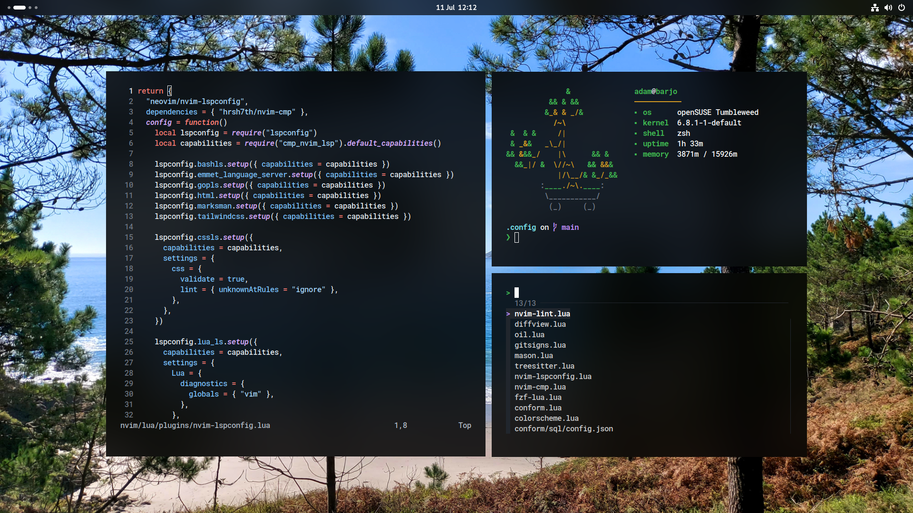

# 📝 Dots

- openSUSE Tumbleweed
- GNOME
- zsh
- tmux
- neovim

## Prerequisites

- bat
- eza
- fd
- fzf
- git-delta
- neovim >= 0.10
- oh-my-zsh
- ripgrep
- starship
- tree-sitter
- zig
- zsh-syntax-highlighting
